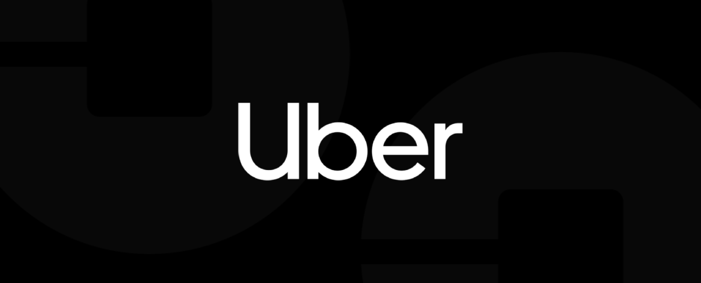
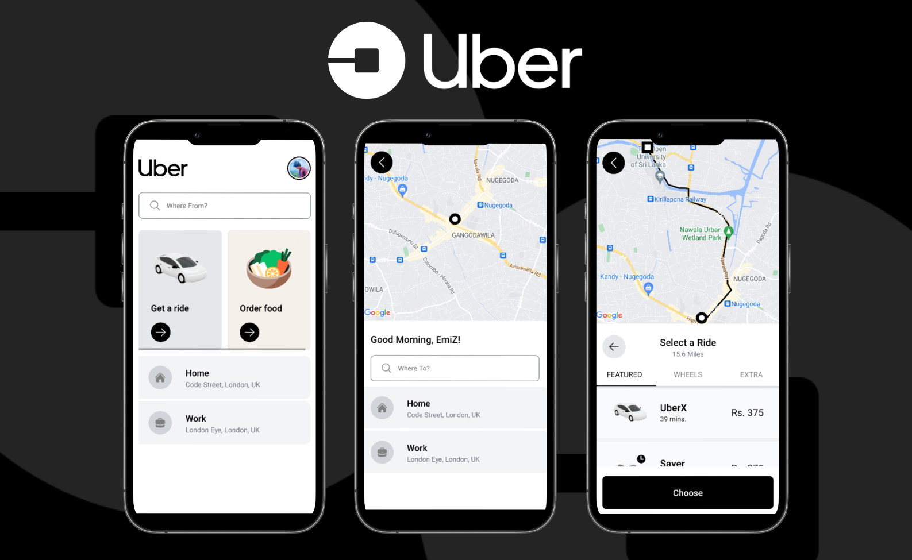

# Uber Mobile

## Table of Contents

- [Introduction](#introduction)
- [Features](#features)
- [Build Process](#build-process)
- [Tech Stack](#tech-stack)

 

## Introduction

Uber is a platform where those who drive and deliver can connect with riders, eaters, and restaurants.

This build was done using React Native, Tailwind CSS and Graph QL only for educational purposes only.

## Features

🚀 Places Auto Complete  
🚀 Select Ride  
🚀 Routing using OSRM

## Build Process

- Clone or download the repo
- `npm install` or `yarn` to install dependencies
- `npx expo start` to run the application

## Tech Stack

    
    
    
    

